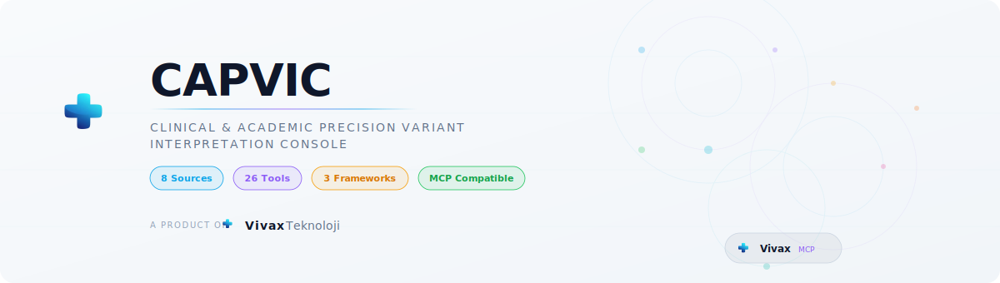
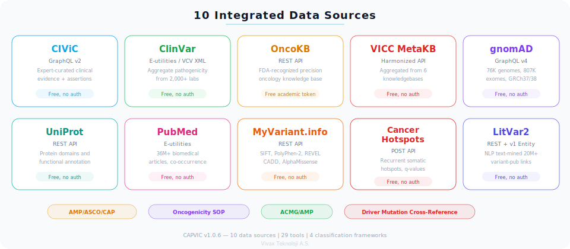
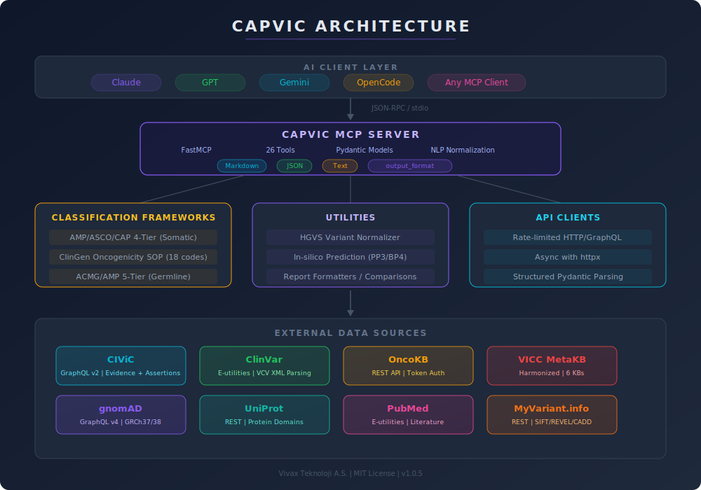
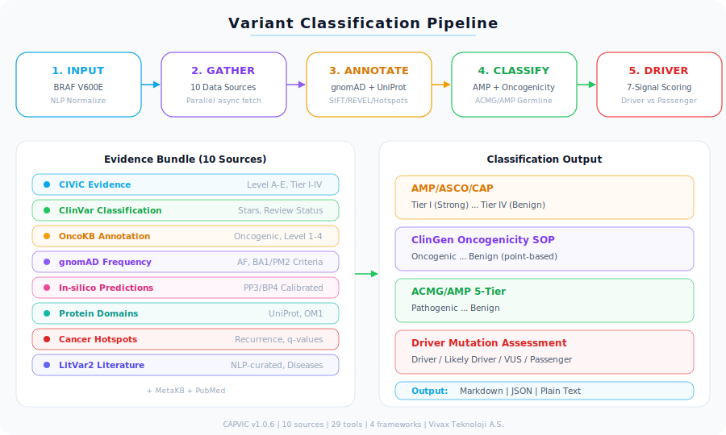
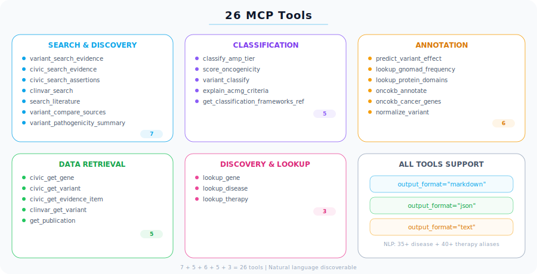
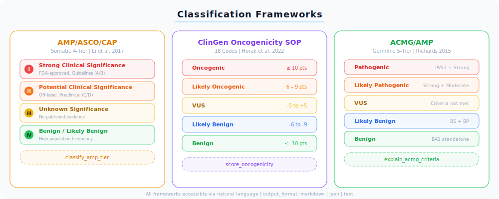

<p align="center">
  
</p>

<p align="center">
  <a href="https://github.com/ArioMoniri/CAPVIC/actions/workflows/ci.yml"></a>
  <a href="https://www.python.org/downloads/"></a>
  <a href="LICENSE"></a>
  <a href="https://modelcontextprotocol.io"></a>
  <a href="https://getvivax.com"></a>
</p>

<p align="center">
  <strong>A production-grade MCP server for precision oncology variant classification</strong><br/>
  Integrating 8 data sources with AMP/ASCO/CAP, ClinGen/CGC/VICC Oncogenicity SOP, and ACMG/AMP classification frameworks.
</p>

---

## 📖 Table of Contents

- [Overview](#-overview)
- [Architecture](#-architecture)
- [Quick Start](#-quick-start)
- [Docker](#-docker)
- [Claude Desktop Integration](#-claude-desktop-integration)
- [OpenCode Integration](#-opencode-integration)
- [Natural Language Prompts](#-natural-language-prompts)
- [Environment Variables](#-environment-variables)
- [Tool Reference (26 Tools)](#-tool-reference)
- [Classification Frameworks](#-classification-frameworks)
- [Example Workflows](#-example-workflows)
- [For ML/AI Competition Teams](#-for-mlai-competition-teams)
- [Data Sources & Freshness](#-data-sources--freshness)
- [Development](#-development)
- [Key References](#-key-references)
- [Known Limitations & Future Work](#-known-limitations--future-work)
- [Disclaimer](#%EF%B8%8F-disclaimer)

---

## 🔬 Overview

CAPVIC turns any AI assistant (Claude, GPT, etc.) into a **virtual molecular tumor board** by providing real-time access to the world's leading clinical genomics knowledgebases and implementing gold-standard classification frameworks as computational logic.

### What It Does

| Capability | Description |
|------------|-------------|
| 🔍 **Multi-source evidence search** | Query CIViC, ClinVar, OncoKB, and MetaKB simultaneously |
| 🏷️ **Somatic classification** | AMP/ASCO/CAP 4-tier (Tier I–IV) with evidence levels (A–D) |
| 📊 **Oncogenicity scoring** | ClinGen/CGC/VICC SOP point-based system (18 evidence codes) |
| 🧪 **Germline interpretation** | ACMG/AMP 5-tier framework reference with ClinVar context |
| ⚖️ **Cross-database comparison** | Side-by-side concordance/discordance analysis |
| 📋 **Pathogenicity summary** | Structured pathogenic vs. benign evidence report |
| 💊 **Therapeutic matching** | FDA-approved & investigational therapies from OncoKB/CIViC |
| 🧬 **Population frequency** | gnomAD allele frequencies for BA1/PM2/SBVS1 criteria |
| 🔀 **Variant normalization** | HGVS notation parsing (V600E ↔ p.Val600Glu) |
| 🏗️ **Protein domain mapping** | UniProt/InterPro domain lookup for OM1 evidence |
| 📚 **Literature search** | PubMed co-occurrence for gene/variant/disease |
| 🤖 **In-silico predictions** | SIFT, PolyPhen-2, REVEL, CADD, AlphaMissense + ClinGen SVI-calibrated PP3/BP4 |

### Data Sources

<p align="center">
  
</p>

| Source | Type | Access | Update Frequency |
|--------|------|--------|-----------------|
| 🟢 [CIViC](https://civicdb.org) | Expert-curated clinical evidence | Free, no auth | Continuous (community-driven) |
| 🟢 [ClinVar](https://www.ncbi.nlm.nih.gov/clinvar/) | Aggregate pathogenicity from 2000+ labs | Free, no auth | Weekly |
| 🟡 [OncoKB](https://www.oncokb.org) | FDA-recognized oncogenicity + therapy levels | Free academic token (requires [registration](https://www.oncokb.org/account/register)) | Continuously |
| 🟢 [VICC MetaKB](https://search.cancervariants.org) | Harmonized from 6 knowledgebases | Free, no auth | Periodic |
| 🟢 [gnomAD](https://gnomad.broadinstitute.org) | Population allele frequencies (76k genomes, 807k exomes) | Free, no auth | Major releases |
| 🟢 [UniProt](https://www.uniprot.org) | Protein domains & functional annotation | Free, no auth | Monthly |
| 🟢 [PubMed](https://pubmed.ncbi.nlm.nih.gov) | Biomedical literature (36M+ articles) | Free, no auth | Daily |
| 🟢 [MyVariant.info](https://myvariant.info) | Aggregated in-silico predictions (dbNSFP) | Free, no auth | Periodic |

---

## 🏗️ Architecture

<p align="center">
  
</p>

<p align="center">
  
</p>

### Project Structure

```
CAPVIC/
├── src/variant_mcp/
│   ├── server.py                  # FastMCP server + 26 tool registrations
│   ├── constants.py               # URLs, enums, evidence codes, disclaimers
│   ├── clients/
│   │   ├── base_client.py         # Async HTTP + rate limiting + retry
│   │   ├── civic_client.py        # CIViC V2 GraphQL client
│   │   ├── clinvar_client.py      # NCBI E-utilities (ClinVar)
│   │   ├── oncokb_client.py       # OncoKB REST API
│   │   ├── metakb_client.py       # VICC MetaKB search
│   │   ├── gnomad_client.py       # gnomAD GraphQL (population frequencies)
│   │   ├── pubmed_client.py       # PubMed E-utilities (literature search)
│   │   ├── uniprot_client.py      # UniProt REST (protein domains)
│   │   └── myvariant_client.py    # MyVariant.info (in-silico predictions)
│   ├── utils/
│   │   └── variant_normalizer.py  # Pure Python HGVS notation parser
│   ├── classification/
│   │   ├── amp_asco_cap.py        # AMP/ASCO/CAP 4-tier somatic classifier
│   │   ├── oncogenicity_sop.py    # ClinGen/CGC/VICC oncogenicity scorer
│   │   └── acmg_amp.py           # ACMG/AMP germline pathogenicity helper
│   ├── models/
│   │   ├── inputs.py             # Pydantic v2 input models (validated)
│   │   ├── evidence.py           # Unified evidence data models
│   │   └── classification.py     # Classification result models
│   ├── formatters/
│   │   ├── reports.py            # Markdown report generators
│   │   └── tables.py            # Framework reference table formatters
│   └── queries/
│       └── civic_graphql.py      # CIViC GraphQL query definitions
├── tests/                        # 131 unit tests (all clients mock-tested)
├── .github/workflows/ci.yml     # CI: lint, typecheck, test (3.11+3.12), build
├── Dockerfile
├── docker-compose.yml
├── pyproject.toml
└── .env.example
```

---

## 🚀 Quick Start

### Prerequisites

- Python 3.11 or later
- (Optional) OncoKB academic API token — [register free](https://www.oncokb.org/apiAccess)
- (Optional) NCBI API key — [get one here](https://www.ncbi.nlm.nih.gov/account/settings/)

### Install

```bash
# Clone the repository
git clone https://github.com/ArioMoniri/CAPVIC.git
cd CAPVIC

# Install in development mode
pip install -e ".[dev]"

# Run the server
python -m variant_mcp.server
```

### Verify Installation

```bash
# Check server loads correctly
python -c "from variant_mcp.server import mcp; print('✅ CAPVIC server OK')"

# Run tests
pytest tests/ -v --tb=short -m "not integration"
```

---

## 🐳 Docker

```bash
# Build the image
docker build -t capvic:latest .

# Or using docker compose
docker compose build
```

### Testing Locally via Docker

The MCP server uses **stdio transport** (JSON-RPC over stdin/stdout). To test interactively:

```bash
# Quick health check — send initialize and list tools
echo '{"jsonrpc":"2.0","id":1,"method":"initialize","params":{"protocolVersion":"2024-11-05","capabilities":{},"clientInfo":{"name":"test","version":"1.0"}}}' \
  | docker run --rm -i capvic:latest
```

To call a tool (pipe must stay open for API calls that take time):

```bash
# Write JSON-RPC messages to a file
cat > /tmp/capvic_test.txt << 'EOF'
{"jsonrpc":"2.0","id":1,"method":"initialize","params":{"protocolVersion":"2024-11-05","capabilities":{},"clientInfo":{"name":"test","version":"1.0"}}}
{"jsonrpc":"2.0","method":"notifications/initialized"}
{"jsonrpc":"2.0","id":2,"method":"tools/call","params":{"name":"normalize_variant","arguments":{"variant":"V600E","gene":"BRAF"}}}
EOF

# Run (sleep keeps stdin open while the server processes)
(cat /tmp/capvic_test.txt; sleep 5) | docker run --rm -i capvic:latest
```

### Example Test Commands

| Test | JSON-RPC `params` |
|------|-------------------|
| **Normalize variant** | `{"name":"normalize_variant","arguments":{"variant":"V600E","gene":"BRAF"}}` |
| **CIViC evidence** | `{"name":"civic_search_evidence","arguments":{"gene":"BRAF","variant":"V600E"}}` |
| **ClinVar search** | `{"name":"clinvar_search","arguments":{"gene":"BRAF","variant":"V600E"}}` |
| **Full classification** | `{"name":"variant_classify","arguments":{"gene":"BRAF","variant":"V600E","disease":"Melanoma","variant_origin":"somatic"}}` |
| **Oncogenicity score** | `{"name":"score_oncogenicity","arguments":{"gene":"BRAF","variant":"V600E"}}` |
| **Protein domains** | `{"name":"lookup_protein_domains","arguments":{"gene":"BRAF","variant":"V600E"}}` |
| **In-silico predictions** | `{"name":"predict_variant_effect","arguments":{"gene":"BRAF","variant":"V600E"}}` |
| **PubMed search** | `{"name":"search_literature","arguments":{"gene":"BRAF","variant":"V600E","limit":5}}` |
| **gnomAD frequency** | `{"name":"lookup_gnomad_frequency","arguments":{"gene":"BRAF","variant":"V600E"}}` |

### With OncoKB Token

```bash
# OncoKB requires a free academic API token from https://www.oncokb.org/account/register
docker run --rm -i -e ONCOKB_API_TOKEN=your_token capvic:latest
```

### Claude Desktop Integration (Docker)

```json
{
  "mcpServers": {
    "variant_mcp": {
      "command": "docker",
      "args": ["run", "--rm", "-i", "capvic:latest"]
    }
  }
}
```

> Works immediately without any tokens. Add `"env": {"ONCOKB_API_TOKEN": "..."}` to enable OncoKB features.

---

## 🖥️ Claude Desktop Integration

Add to your `claude_desktop_config.json`:

```json
{
  "mcpServers": {
    "variant_mcp": {
      "command": "python",
      "args": ["-m", "variant_mcp.server"],
      "cwd": "/path/to/CAPVIC",
      "env": {
        "PYTHONPATH": "/path/to/CAPVIC/src"
      }
    }
  }
}
```

Or using the installed entry point:

```json
{
  "mcpServers": {
    "variant_mcp": {
      "command": "variant-mcp"
    }
  }
}
```

> Both configs work out of the box. OncoKB and NCBI API keys are **optional** — see [Environment Variables](#-environment-variables).

---

## 🟢 OpenCode Integration

[OpenCode](https://opencode.ai/) is an open-source AI coding agent (terminal TUI, desktop app, IDE extension) with native MCP support. CAPVIC works with OpenCode out of the box.

Add to your `opencode.json` (project root or `~/.config/opencode/opencode.json`):

```json
{
  "$schema": "https://opencode.ai/config.json",
  "mcp": {
    "variant_mcp": {
      "type": "local",
      "command": ["python3", "-m", "variant_mcp.server"],
      "enabled": true,
      "environment": {
        "PYTHONPATH": "/path/to/CAPVIC/src",
        "ONCOKB_API_TOKEN": "{env:ONCOKB_API_TOKEN}",
        "NCBI_API_KEY": "{env:NCBI_API_KEY}"
      },
      "timeout": 30000
    }
  }
}
```

> **API keys**: `ONCOKB_API_TOKEN` enables OncoKB annotation tools ([free academic access](https://www.oncokb.org/apiAccess)). `NCBI_API_KEY` increases ClinVar/PubMed rate limits from 3 to 10 req/sec. Both are optional — tools work without them but with reduced functionality or rate limits. OpenCode's `{env:VAR_NAME}` syntax reads from your shell environment.

Or using Docker:

```json
{
  "$schema": "https://opencode.ai/config.json",
  "mcp": {
    "variant_mcp": {
      "type": "local",
      "command": ["docker", "run", "--rm", "-i", "capvic:latest"],
      "enabled": true,
      "timeout": 30000
    }
  }
}
```

**Key differences from Claude Desktop config:**
- Top-level key is `"mcp"` (not `"mcpServers"`)
- Requires `"type": "local"` for stdio transport
- Command and args are a **single array** in `"command"`
- Environment variables go in `"environment"` (not `"env"`)
- Supports `{env:VAR_NAME}` substitution (e.g., `"ONCOKB_API_TOKEN": "{env:ONCOKB_API_TOKEN}"`)

**Verify with OpenCode CLI:**
```bash
opencode mcp list           # List configured MCP servers
opencode mcp debug variant_mcp  # Debug connection issues
```

> All 26 CAPVIC tools are available in OpenCode. The same natural language prompts from the section below work in OpenCode, Claude Desktop, or any MCP client.

---

## 💬 Natural Language Prompts

CAPVIC tools are designed to work with natural language. Ask questions as you would to a bioinformatician — the AI client (Claude, OpenCode, GPT, etc.) maps your question to the right tool(s) automatically.

### Example Prompts

| Prompt | Tools Used |
|--------|-----------|
| "Find evidences for colorectal cancer therapies involving KRAS mutations. Create detailed data visualization to compare!" | `variant_search_evidence` + `civic_search_evidence` + `variant_compare_sources` |
| "What is the clinical significance of BRAF V600E in melanoma?" | `variant_classify` or `variant_search_evidence` |
| "Are there any FDA-approved therapies targeting EGFR T790M?" | `oncokb_annotate` + `civic_search_assertions` |
| "Is TP53 R175H oncogenic? Score it." | `score_oncogenicity` + `predict_variant_effect` |
| "Compare what CIViC, ClinVar, and OncoKB say about NRAS Q61K" | `variant_compare_sources` |
| "Show me the population frequency and protein domains for BRCA1 C61G" | `lookup_gnomad_frequency` + `lookup_protein_domains` |
| "Find recent publications about KRAS G12C resistance in lung cancer" | `search_literature` |
| "Create a pathogenicity report for ALK F1174L" | `variant_pathogenicity_summary` |
| "What ACMG criteria apply to BRCA2 variants?" | `explain_acmg_criteria` |
| "Explain the AMP/ASCO/CAP and oncogenicity classification frameworks" | `get_classification_frameworks_reference` |

### Output Formats

All 26 tools accept an optional `output_format` parameter:

| Format | Description | Use Case |
|--------|-------------|----------|
| `"markdown"` | Rich formatted markdown with tables, headers, emojis (default) | AI chat, reports, artifacts |
| `"json"` | Raw structured data from Pydantic models | Programmatic access, pipelines, data visualization |
| `"text"` | Plain text, no formatting | Simple displays, logging, CLI output |

```python
# Get raw JSON data for programmatic use
variant_search_evidence(gene="KRAS", disease="CRC", output_format="json")

# Get plain text for logging
clinvar_search(gene="BRAF", variant="V600E", output_format="text")
```

### Disease & Therapy Abbreviations

Tools that accept disease/therapy parameters auto-expand common abbreviations:

| Input | Expands To | Input | Expands To |
|-------|-----------|-------|-----------|
| CRC | Colorectal Cancer | keytruda | Pembrolizumab |
| NSCLC | Lung Non-small Cell Carcinoma | gleevec | Imatinib |
| GBM | Glioblastoma Multiforme | tagrisso | Osimertinib |
| TNBC | Triple Negative Breast Cancer | lumakras | Sotorasib |
| HCC | Hepatocellular Carcinoma | erbitux | Cetuximab |

### Visualization & Artifacts

All tool outputs return structured markdown with tables, headers, and data breakdowns — ready for:
- **Comparison tables**: `variant_compare_sources` produces side-by-side source concordance
- **Evidence heatmaps**: `civic_search_evidence` returns structured evidence type/level data
- **Score charts**: `score_oncogenicity` returns point breakdowns by evidence code
- **Predictor comparisons**: `predict_variant_effect` returns a 7-predictor score table
- **Domain maps**: `lookup_protein_domains` returns domain ranges for position mapping
- **Population plots**: `lookup_gnomad_frequency` returns per-population AF data

AI clients can use these structured outputs to generate plots, charts, and interactive artifacts.

---

## 🔑 Environment Variables

| Variable | Required | Description |
|----------|----------|-------------|
| `ONCOKB_API_TOKEN` | No | OncoKB API token ([free academic access](https://www.oncokb.org/apiAccess)). Without it, OncoKB tools return a helpful registration message. |
| `NCBI_API_KEY` | No | NCBI API key. Increases ClinVar rate limit from 3 → 10 requests/sec. |

---

## 🛠️ Tool Reference

<p align="center">
  
</p>

### Category 1: Multi-Source Power Tools ⚡

| # | Tool | Description | Key Inputs |
|---|------|-------------|------------|
| 1 | `variant_search_evidence` | 🔍 Query ALL databases simultaneously for unified evidence | `gene`\*, `variant`, `disease`, `therapy`, `evidence_type`, `sources`, `limit` |
| 2 | `variant_classify` | 🏷️ Apply classification framework(s) — somatic or germline | `gene`\*, `variant`\*, `disease`, `variant_origin`\* |
| 3 | `variant_compare_sources` | ⚖️ Cross-database concordance/discordance analysis | `gene`\*, `variant`\* |
| 20 | `variant_pathogenicity_summary` | 📋 Structured pathogenic vs. benign evidence report | `gene`\*, `variant`\*, `disease` |

### Category 2: CIViC Tools 🧬

| # | Tool | Description | Key Inputs |
|---|------|-------------|------------|
| 4 | `civic_search_evidence` | Search CIViC clinical evidence items | `gene`, `variant`, `disease`, `therapy`, `evidence_type` |
| 5 | `civic_search_assertions` | Search curated CIViC assertions | `gene`, `disease`, `therapy`, `significance` |
| 6 | `civic_get_gene` | Get gene details + variant list | `name`\* |
| 7 | `civic_get_variant` | Get variant + molecular profiles | `variant_id`\* |
| 8 | `civic_get_evidence_item` | Get full evidence item detail | `evidence_id`\* |

### Category 3: ClinVar Tools 🏥

| # | Tool | Description | Key Inputs |
|---|------|-------------|------------|
| 9 | `clinvar_search` | Search ClinVar by gene, variant, significance, disease | `gene`, `variant`, `clinical_significance` |
| 10 | `clinvar_get_variant` | Full record by variation ID, rsID, or HGVS | `variation_id`, `rsid`, `hgvs` |

### Category 4: OncoKB Tools 💊

| # | Tool | Description | Key Inputs |
|---|------|-------------|------------|
| 11 | `oncokb_annotate` | Annotate somatic mutation (oncogenicity + therapy) | `gene`\*, `variant`\*, `tumor_type` |
| 12 | `oncokb_cancer_genes` | List all OncoKB cancer genes (oncogene/TSG status) | — |

### Category 5: Classification Framework Tools 📊

| # | Tool | Description | Key Inputs |
|---|------|-------------|------------|
| 13 | `classify_amp_tier` | AMP/ASCO/CAP 4-tier somatic classification | `gene`\*, `variant`\*, `disease` |
| 14 | `score_oncogenicity` | ClinGen/CGC/VICC point-based oncogenicity SOP | `gene`\*, `variant`\*, `evidence_codes` |
| 15 | `explain_acmg_criteria` | ACMG/AMP germline criteria reference | `criteria_code`, `query` |

### Category 6: Discovery Tools 🔎

| # | Tool | Description | Key Inputs |
|---|------|-------------|------------|
| 16 | `lookup_gene` | Gene name autocomplete | `query`\* |
| 17 | `lookup_disease` | Disease name autocomplete (DOID, OncoTree) | `query`\* |
| 18 | `lookup_therapy` | Therapy/drug name autocomplete | `query`\* |

### Category 7: Utility Tools 📚

| # | Tool | Description | Key Inputs |
|---|------|-------------|------------|
| 19 | `get_classification_frameworks_reference` | Complete reference for all 3 frameworks | — |

### Category 8: Scientific Enhancement Tools 🧬 (Phase 10)

| # | Tool | Description | Key Inputs |
|---|------|-------------|------------|
| 21 | `lookup_gnomad_frequency` | 🧬 Population allele frequencies from gnomAD (BA1/PM2/SBVS1) | `variant_id`\*, `genome_version` |
| 22 | `normalize_variant` | 🔀 Parse & convert variant notation (V600E ↔ p.Val600Glu) | `variant`\*, `gene` |
| 23 | `lookup_protein_domains` | 🏗️ Protein functional domains from UniProt/InterPro (OM1) | `gene`\*, `variant`, `position` |
| 24 | `search_literature` | 📚 PubMed literature co-occurrence search | `gene`\*, `variant`, `disease`, `limit` |
| 25 | `get_publication` | 📄 Fetch full publication details by PMID | `pmid`\* |
| 26 | `predict_variant_effect` | 🤖 SIFT/PolyPhen-2/REVEL/CADD/AlphaMissense + ClinGen SVI PP3/BP4 strength | `gene`\*, `variant`\*, `hgvs_id` |

\* = required parameter

---

## 📊 Classification Frameworks

<p align="center">
  
</p>

### 1. AMP/ASCO/CAP 4-Tier Somatic Classification

> *Li et al., J Mol Diagn 2017. PMID: [27993330](https://pubmed.ncbi.nlm.nih.gov/27993330/)*

**Use for**: Somatic (cancer) variant clinical significance

| Tier | Name | Evidence Levels | Description |
|------|------|-----------------|-------------|
| **I** | 🔴 Strong Clinical Significance | **A**: FDA-approved, guidelines | **B**: Well-powered studies, consensus |
| **II** | 🟠 Potential Clinical Significance | **C**: FDA-approved (different tumor) | **D**: Preclinical / case reports |
| **III** | 🟡 Unknown Clinical Significance | — | No convincing published evidence |
| **IV** | 🟢 Benign / Likely Benign | — | High population frequency, no cancer association |

### 2. ClinGen/CGC/VICC Oncogenicity SOP

> *Horak et al., Genet Med 2022. PMID: [35101336](https://pubmed.ncbi.nlm.nih.gov/35101336/)*

**Use for**: Somatic variant oncogenicity assessment (point-based)

> 🧪 **Integrated pipeline**: When auto-detecting evidence codes, the scorer automatically uses UniProt domain data for **OM1** and MyVariant.info in-silico predictions for **OP1/SBP1** — all 8 data sources feed into a single classification call.

| Classification | Points | Oncogenic Codes | Benign Codes |
|---------------|--------|-----------------|--------------|
| 🔴 **Oncogenic** | ≥ 10 | OVS1 (+8), OS1-3 (+4 each) | — |
| 🟠 **Likely Oncogenic** | 6–9 | OM1-4 (+2 each) | — |
| 🟡 **VUS** | −5 to +5 | OP1-4 (+1 each) | — |
| 🔵 **Likely Benign** | −6 to −9 | — | SBP1-2 (−1 each) |
| 🟢 **Benign** | ≤ −10 | — | SBVS1 (−8), SBS1-2 (−4 each) |

### 3. ACMG/AMP 5-Tier Germline Pathogenicity

> *Richards et al., Genet Med 2015. PMID: [25741868](https://pubmed.ncbi.nlm.nih.gov/25741868/)*

**Use for**: Germline (inherited) variant pathogenicity

| Classification | Key Criteria |
|---------------|-------------|
| 🔴 **Pathogenic** | PVS1 + ≥1 Strong; or ≥2 Strong; or 1 Strong + ≥3 Moderate/Supporting |
| 🟠 **Likely Pathogenic** | PVS1 + 1 Moderate; or 1 Strong + 1–2 Moderate |
| 🟡 **VUS** | Criteria not met for any other classification |
| 🔵 **Likely Benign** | 1 Strong benign + 1 Supporting benign |
| 🟢 **Benign** | BA1 standalone; or ≥2 Strong benign |

### When to Use Which Framework

| Context | Framework | Notes |
|---------|-----------|-------|
| Somatic variant, clinical actionability question | **AMP/ASCO/CAP** | Focus on therapeutic, diagnostic, prognostic significance |
| Somatic variant, oncogenicity question | **ClinGen/CGC/VICC SOP** | Point-based scoring for oncogenic vs. benign |
| Germline variant, disease causation question | **ACMG/AMP** | For inherited variants — requires expert review |
| Both somatic questions | **AMP + Oncogenicity SOP** | Complementary — AMP = clinical action, SOP = biological mechanism |

---

## 💡 Example Workflows

### 🧪 "Classify BRAF V600E in melanoma" — Full Classification

```python
variant_classify(gene="BRAF", variant="V600E", disease="Melanoma", variant_origin="somatic")
```

<details>
<summary>Real output (click to expand)</summary>

```
# Variant Classification Report

Gene: BRAF | Variant: V600E | Origin: Somatic
Disease Context: Melanoma
Sources queried: CIViC, ClinVar

## AMP/ASCO/CAP Classification
Tier I — Strong Clinical Significance (Level A)

Evidence trail:
- CIViC: 1 Level A (Validated) evidence items
- CIViC evidence type: PREDICTIVE (23 items)
- CIViC evidence type: PROGNOSTIC (2 items)

## ClinGen/CGC/VICC Oncogenicity Assessment
Classification: LIKELY ONCOGENIC (Score: 7 points)

| Code | Points | Evidence                                                |
|------|--------|---------------------------------------------------------|
| OS3  | +4     | Located in hotspot with sufficient statistical evidence |
| OM4  | +2     | Absent/extremely rare in population databases           |
| OP2  | +1     | Somatic variant in gene with single cancer etiology     |
```

</details>

### 🤖 "In-silico predictions for TP53 R175H"

```python
predict_variant_effect(gene="TP53", variant="R175H")
```

<details>
<summary>Real output (click to expand)</summary>

```
## In-Silico Predictions — TP53 R175H

Consensus: Damaging (3/4 damaging, 0/4 benign)

| Predictor     | Score  | Prediction | Threshold                          |
|---------------|--------|------------|------------------------------------|
| SIFT          | 0.0000 | D          | <0.05 = damaging                   |
| PolyPhen-2    | 0.9990 | D          | >0.85 = prob. damaging             |
| REVEL         | 0.9310 | → PP3_moderate | ClinGen SVI: ≥0.932 strong, ≥0.773 moderate  |
| AlphaMissense | 0.9850 | P          | >0.564 = likely pathogenic         |

ClinGen SVI REVEL assessment: PP3_moderate (score 0.931, Pejaver et al. 2022)
```

</details>

### 🏗️ "Is BRAF V600E in a functional domain?"

```python
lookup_protein_domains(gene="BRAF", variant="V600E")
```

<details>
<summary>Real output (click to expand)</summary>

```
## Domain Check — BRAF V600E

Position: 600
In functional domain: ✅ Yes
Supports OM1: ✅ Yes

| Domain         | Type   | Range   | Source         |
|----------------|--------|---------|----------------|
| Protein kinase | Domain | 457–717 | PROSITE-ProRule |

OM1: Located in critical/functional domain (+2 points in oncogenicity SOP)
```

</details>

### 📚 "Find papers on EGFR T790M resistance"

```python
search_literature(gene="EGFR", variant="T790M", disease="lung cancer", limit=3)
```

<details>
<summary>Real output (click to expand)</summary>

```
## PubMed Literature Search

Query: EGFR[gene] AND T790M AND lung cancer
Total publications found: 3282

1. Overcoming EGFR(T790M) and EGFR(C797S) resistance with mutant-selective
   allosteric inhibitors.
   Authors: Jia Y, Yun CH, Park E et al. | Nature (2016) | PMID: 27251290

2. EGFR-TKI resistance promotes immune escape in lung cancer via increased
   PD-L1 expression.
   Authors: Peng S, Wang R, Zhang X et al. | Mol Cancer (2019) | PMID: 31747941

3. Osimertinib and other third-generation EGFR TKI in EGFR-mutant NSCLC patients.
   Authors: Remon J, Steuer CE, Ramalingam SS et al. | Ann Oncol (2018) | PMID: 29462255
```

</details>

### 🧬 "CIViC evidence for BRAF V600E"

```python
civic_search_evidence(gene="BRAF", variant="V600E")
```

<details>
<summary>Real output (click to expand)</summary>

```
# CIViC Evidence Search Results (25 items)

- EID1409  [PREDICTIVE] Level A — SENSITIVITY | Skin Melanoma | Vemurafenib
- EID9851  [PREDICTIVE] Level A — SENSITIVITY | Colorectal Cancer | Encorafenib, Cetuximab
- EID12016 [PREDICTIVE] Level A — SENSITIVITY | Childhood Low-grade Glioma | Tovorafenib
- EID3017  [PREDICTIVE] Level A — SENSITIVITY | Lung Non-small Cell Carcinoma | Dabrafenib, Trametinib
- EID12161 [PREDICTIVE] Level A — SENSITIVITY | Solid Tumor | Dabrafenib, Trametinib
- EID80    [DIAGNOSTIC] Level B — POSITIVE | Papillary Thyroid Carcinoma
- EID95    [PREDICTIVE] Level B — SENSITIVITY | Melanoma | Dabrafenib, Trametinib
- EID816   [PREDICTIVE] Level B — RESISTANCE | Colorectal Cancer | Cetuximab, Panitumumab
  ... (25 total items across 6 cancer types)
```

</details>

### 💊 "What therapies work for KRAS G12C in NSCLC?"

```python
variant_search_evidence(gene="KRAS", variant="G12C", disease="Non-small Cell Lung Cancer")
```

Returns: Sotorasib (Lumakras) and adagrasib (Krazati) from CIViC Level A evidence, plus resistance and combination therapy data.

### ⚖️ "Compare databases for PIK3CA H1047R"

```python
variant_compare_sources(gene="PIK3CA", variant="H1047R")
```

Returns: Side-by-side concordance across CIViC, ClinVar, OncoKB, and MetaKB showing agreements and discrepancies.

### 🧬 "gnomAD frequency for a variant"

```python
# GRCh38 (default) — BRAF V600E
lookup_gnomad_frequency(variant_id="7-140753336-A-T")

# GRCh37 — same variant, different coordinate
lookup_gnomad_frequency(variant_id="7-140453136-A-T", genome_version="GRCh37")
```

Returns: Global AF, per-population frequencies, and clinical interpretation for BA1/PM2/SBVS1/OM4 criteria. Requires chrom-pos-ref-alt format (see [Limitations](#-known-limitations--future-work)).

---

## 🏆 For ML/AI Competition Teams

CAPVIC is designed to help teams building ML models that predict variant pathogenicity (e.g., Kaggle competitions, CAGI challenges). Here's how:

### 1. Build Training Data Features

```python
# For each variant in your dataset, extract features:
predict_variant_effect(gene="BRAF", variant="V600E")
#   → SIFT=0.0, PolyPhen2=0.971, REVEL=0.931, AlphaMissense=0.985
#   → PP3_moderate (ClinGen SVI calibrated, Pejaver et al. 2022)

lookup_protein_domains(gene="BRAF", variant="V600E")
#   → in_domain=True, domain="Protein kinase" (457-717)
#   → Feature: is_in_functional_domain = 1

search_literature(gene="BRAF", variant="V600E", limit=1)
#   → total_count=4500+ publications
#   → Feature: log_publication_count = 3.65
```

### 2. Validate Predictions Against Expert Consensus

```python
# Your model predicts EGFR L858R = Pathogenic (score 0.97)
variant_pathogenicity_summary(gene="EGFR", variant="L858R")
#   → CIViC: 25+ evidence items, all SENSITIVITY or ONCOGENIC
#   → ClinVar: Pathogenic (expert-reviewed)
#   → Consensus: STRONG agreement with your prediction ✅
```

### 3. Find & Understand Edge Cases

```python
# Your model predicts VHL R167Q = VUS (score 0.52)
variant_classify(gene="VHL", variant="R167Q", variant_origin="germline")
#   → ClinVar: conflicting interpretations (Pathogenic vs VUS)
#   → Genuinely ambiguous — your model captures the uncertainty ✅

# Your model predicts IDH1 R132H = Benign (score 0.15) — WRONG!
variant_compare_sources(gene="IDH1", variant="R132H")
#   → Every source: Oncogenic/Pathogenic with high confidence
#   → Hotspot, gain-of-function → investigate feature engineering 🔍
```

### 4. Batch Feature Extraction (for competitions)

```python
# Use the MCP tools programmatically to build feature vectors:
for gene, variant in your_dataset:
    # In-silico scores (SIFT, PolyPhen2, REVEL, CADD, AlphaMissense)
    preds = predict_variant_effect(gene=gene, variant=variant)

    # Domain context (binary: in functional domain or not)
    domains = lookup_protein_domains(gene=gene, variant=variant)

    # Literature signal (publication count as proxy for research interest)
    lit = search_literature(gene=gene, variant=variant, limit=1)

    # ClinVar consensus (if available — for labeled data validation)
    clinvar = clinvar_search(gene=gene, variant=variant)
```

### 5. Use Cases by Competition Type

| Competition Type | Useful CAPVIC Tools | Features You Get |
|-----------------|-------------------|-----------------|
| **Variant pathogenicity** (CAGI, Kaggle) | `predict_variant_effect`, `lookup_protein_domains` | SIFT, PP2, REVEL, CADD, AM scores + domain flags |
| **Drug response prediction** | `civic_search_evidence`, `variant_search_evidence` | Therapy-variant associations, evidence levels |
| **Variant prioritization** | `variant_classify`, `score_oncogenicity` | AMP tier, oncogenicity score, evidence codes |
| **Literature-based NLP** | `search_literature`, `get_publication` | Abstracts, MeSH terms, citation counts |

---

## 📡 Data Sources & Freshness

| Source | Update Frequency | Coverage | Notes |
|--------|-----------------|----------|-------|
| **CIViC** | Continuous | ~3,800 evidence items, ~400 genes | Community-curated, expert-reviewed |
| **ClinVar** | Weekly (Sunday) | 2.5M+ variant submissions | Aggregate from 2,000+ laboratories |
| **OncoKB** | Continuously | ~700 genes, ~5,400 alterations | FDA-recognized, MSK-curated |
| **VICC MetaKB** | Periodic | Harmonized from 6 KBs | CIViC + OncoKB + CGI + JAX-CKB + MMatch + PMKB |
| **gnomAD** | Major releases | 76,156+ genomes (v4.1) | Population AF for BA1/PM2/SBVS1/OM4 criteria |
| **UniProt** | Monthly | 570K+ reviewed entries | Protein domains, functional annotation |
| **PubMed** | Daily | 36M+ biomedical articles | Literature co-occurrence for evidence support |
| **MyVariant.info** | Periodic | Aggregated dbNSFP | SIFT, PolyPhen, REVEL, CADD, AlphaMissense |

> 📌 All API responses include retrieval timestamps. ClinVar data may be up to 7 days old; CIViC and OncoKB are near real-time.

### 🧬 Genome Build Reference

| Tool | Default Build | Notes |
|------|--------------|-------|
| `lookup_gnomad_frequency` | **GRCh38** (gnomAD v4) | Pass `genome_version="GRCh37"` for gnomAD v2. Coordinates differ between builds. |
| `predict_variant_effect` | **GRCh37** (hg19) | `hgvs_id` parameter must use hg19 coordinates. Gene+variant search is build-agnostic. |
| `clinvar_get_variant` | **GRCh38** | ClinVar returns GRCh38 coordinates by default. Queries by gene/variant name are build-agnostic. |
| `oncokb_annotate` | Build-agnostic | Uses protein-level queries (gene + variant name). HGVSg annotation defaults to GRCh38. |
| All other tools | Build-agnostic | CIViC, UniProt, PubMed query by gene/variant name, not coordinates. |

> **Important**: When using `lookup_gnomad_frequency`, provide coordinates matching the genome build. BRAF V600E is `7-140753336-A-T` on GRCh38 and `7-140453136-A-T` on GRCh37.
>
> **Tip for classification**: For the most accurate oncogenicity scoring, first call `lookup_gnomad_frequency` to get population allele frequencies, then call `variant_classify`. Without gnomAD data, frequency-based evidence codes (SBVS1, SBS1, OM4, OP4) cannot be applied.

---

## 🧑‍💻 Development

### Setup

```bash
pip install -e ".[dev]"
```

### Commands

```bash
# Run tests (131 unit tests)
pytest tests/ -v --tb=short -m "not integration"

# Lint
ruff check src/ tests/
ruff format src/ tests/

# Type check
mypy src/variant_mcp/ --ignore-missing-imports

# Build package
python -m build
```

### CI/CD

GitHub Actions runs on every push:
1. **Lint** — ruff check + format verification
2. **Typecheck** — mypy strict(ish) checking
3. **Test** — pytest on Python 3.11 + 3.12 matrix
4. **Build** — package build + wheel verification

---

## 📚 Key References

| # | Reference | PMID |
|---|-----------|------|
| 1 | Li MM, et al. (2017). "Standards and Guidelines for the Interpretation and Reporting of Sequence Variants in Cancer." *J Mol Diagn*, 19(1):4-23. | [27993330](https://pubmed.ncbi.nlm.nih.gov/27993330/) |
| 2 | Horak P, et al. (2022). "Standards for the classification of pathogenicity of somatic variants in cancer (oncogenicity)." *Genet Med*, 24(4):986-998. | [35101336](https://pubmed.ncbi.nlm.nih.gov/35101336/) |
| 3 | Richards S, et al. (2015). "Standards and guidelines for the interpretation of sequence variants." *Genet Med*, 17(5):405-424. | [25741868](https://pubmed.ncbi.nlm.nih.gov/25741868/) |
| 4 | Griffith M, et al. (2017). "CIViC is a community knowledgebase for expert crowdsourcing the clinical interpretation of variants in cancer." *Nat Genet*, 49(2):170-174. | [28138153](https://pubmed.ncbi.nlm.nih.gov/28138153/) |
| 5 | Wagner AH, et al. (2020). "A harmonized meta-knowledgebase of clinical interpretations of somatic genomic variants in cancer." *Nat Genet*, 52(4):448-457. | [32246132](https://pubmed.ncbi.nlm.nih.gov/32246132/) |
| 6 | Chakravarty D, et al. (2017). "OncoKB: A Precision Oncology Knowledge Base." *JCO Precis Oncol*, 2017:PO.17.00011. | [28890946](https://pubmed.ncbi.nlm.nih.gov/28890946/) |
| 7 | Chen S, et al. (2024). "A genomic mutational constraint map using variation in 76,156 human genomes." *Nature*, 625:92-100. | [38057664](https://pubmed.ncbi.nlm.nih.gov/38057664/) |
| 8 | Ioannidis NM, et al. (2016). "REVEL: An Ensemble Method for Predicting the Pathogenicity of Rare Missense Variants." *Am J Hum Genet*, 99(4):877-885. | [27666373](https://pubmed.ncbi.nlm.nih.gov/27666373/) |
| 9 | Cheng J, et al. (2023). "Accurate proteome-wide missense variant effect prediction with AlphaMissense." *Science*, 381(6664):eadg7492. | [37733863](https://pubmed.ncbi.nlm.nih.gov/37733863/) |
| 10 | Pejaver V, et al. (2022). "Calibration of computational tools for missense variant pathogenicity classification." *Am J Hum Genet*, 109(12):2163-2177. | [36413997](https://pubmed.ncbi.nlm.nih.gov/36413997/) |

---

## 🚧 Known Limitations & Future Work

The following integrations were evaluated but **intentionally excluded** or scoped down to maintain production-readiness. Each would require substantial new code, external service dependencies, or complex parsing that cannot be reliably unit-tested:

| Limitation | Reason | Impact | Workaround |
|-----------|--------|--------|------------|
| **gnomAD gene+variant search** | gnomAD's search API returns HTML URLs that require fragile string parsing to extract variant IDs. No stable API for protein-change → genomic-coordinate mapping exists. | Users must provide `variant_id` in chrom-pos-ref-alt format (e.g., `7-140453136-A-T`) rather than gene+protein change. | Use ClinVar's HGVS expressions or external tools like [Ensembl VEP](https://www.ensembl.org/vep) to convert protein changes to genomic coordinates. |
| **Automated HGVS → genomic coordinate mapping** | Requires a reference genome + transcript database (e.g., UTA, SeqRepo) — heavy infrastructure not suitable for an MCP server. Libraries like `hgvs` (biocommons) need PostgreSQL + 20GB+ of sequence data. | Cannot auto-convert `p.Val600Glu` to `chr7:g.140453136A>T` for gnomAD/MyVariant.info lookups. | Provide genomic HGVS IDs directly, or use the variant normalizer for protein-level notation and then look up genomic coordinates externally. |
| **ClinGen Allele Registry integration** | Would provide canonical allele IDs for cross-database linking. Requires complex registration workflows and the API has no stable versioning. | No canonical allele ID cross-linking between databases. | Use gene+variant name search (works for CIViC, ClinVar, OncoKB) or provide database-specific IDs. |
| **Functional assay databases (MAVE, DMS)** | Multiplexed Assay of Variant Effect data (e.g., from MaveDB) would strengthen OS2 evidence code. API is experimental and data format varies per assay. | No direct functional assay score integration for OS2 evidence. | Cite functional studies found via `search_literature` tool. |
| **SpliceAI / splice prediction** | Would strengthen PVS1 and splice-site variant assessment. Requires either a 10GB+ model or a paid API, and splice prediction is computationally intensive. | Splice-site variants are detected but not scored for splicing impact. | Use external splice predictors (SpliceAI, MaxEntScan) and feed results into oncogenicity assessment manually. |
| **Automated ACMG/AMP germline classification scoring** | Full ACMG/AMP requires combining 28 evidence criteria with complex combination rules (PVS1 decision trees, segregation data, de novo confirmation). Building a validated, rule-complete implementation is a multi-month effort. | ACMG criteria are explained and referenced, but not auto-scored. Germline classification relies on ClinVar's aggregate expert consensus. | Use `explain_acmg_criteria` for criteria reference, and `clinvar_search` for expert-reviewed germline classifications. |
| **PharmGKB / CPIC pharmacogenomics** | Would add drug-gene interaction annotations. Different data model from somatic classification; would require a separate classification framework. | No pharmacogenomic annotations for germline drug metabolism variants. | Use OncoKB for somatic therapeutic levels, which covers FDA-approved biomarkers. |

### 🔬 Bioinformatician's Assessment

From a clinical genomics perspective, the current tool covers the **core evidence gathering and classification workflow** used in molecular tumor boards:

1. **Evidence aggregation** ✅ — CIViC, ClinVar, OncoKB, MetaKB provide the primary sources used in clinical reporting
2. **Somatic classification** ✅ — AMP/ASCO/CAP + oncogenicity SOP cover the standard-of-care frameworks
3. **Population frequency** ✅ — gnomAD direct lookup handles the most common BA1/PM2 queries
4. **In-silico predictions** ✅ — 7 predictors via MyVariant.info with ClinGen SVI-calibrated REVEL thresholds for PP3/BP4 evidence strength (Pejaver et al. 2022)
5. **Protein domain context** ✅ — UniProt provides OM1 evidence
6. **Literature context** ✅ — PubMed search supports evidence review
7. **Integrated classification pipeline** ✅ — UniProt domain data (OM1) and in-silico predictions (OP1/SBP1) are **automatically fed** into the oncogenicity scorer when using `variant_classify`, `variant_pathogenicity_summary`, or `score_oncogenicity` with auto-detection — no manual tool chaining required
8. **End-to-end report visibility** ✅ — Evidence reports, pathogenicity summaries, and source comparisons all display protein domain context and in-silico prediction tables when data is available

The limitations above represent **advanced features** that typically require institutional infrastructure (reference genomes, local databases, licensed tools) and are beyond the scope of a lightweight MCP server.

---

## ⚠️ Disclaimer

> **RESEARCH DISCLAIMER**: This tool aggregates data from CIViC, ClinVar, OncoKB, and VICC MetaKB for **research and educational purposes only**. Classification suggestions follow published AMP/ASCO/CAP, ClinGen/CGC/VICC, and ACMG/AMP frameworks but are **computationally derived approximations** — NOT validated clinical interpretations. Clinical variant classification MUST be performed by qualified molecular pathologists using validated laboratory procedures. Do not use for clinical decision-making without professional review.

---

## 📄 License

MIT License — see [LICENSE](LICENSE) for details.

Copyright (c) 2026 [Vivax Teknoloji A.S.](https://getvivax.com)

---

<p align="center">
  
  <br/>
  <strong>CAPVIC</strong> — A product of <a href="https://getvivax.com">Vivax Teknoloji A.S.</a>
  <br/>
  Built for the precision oncology research community
</p>
